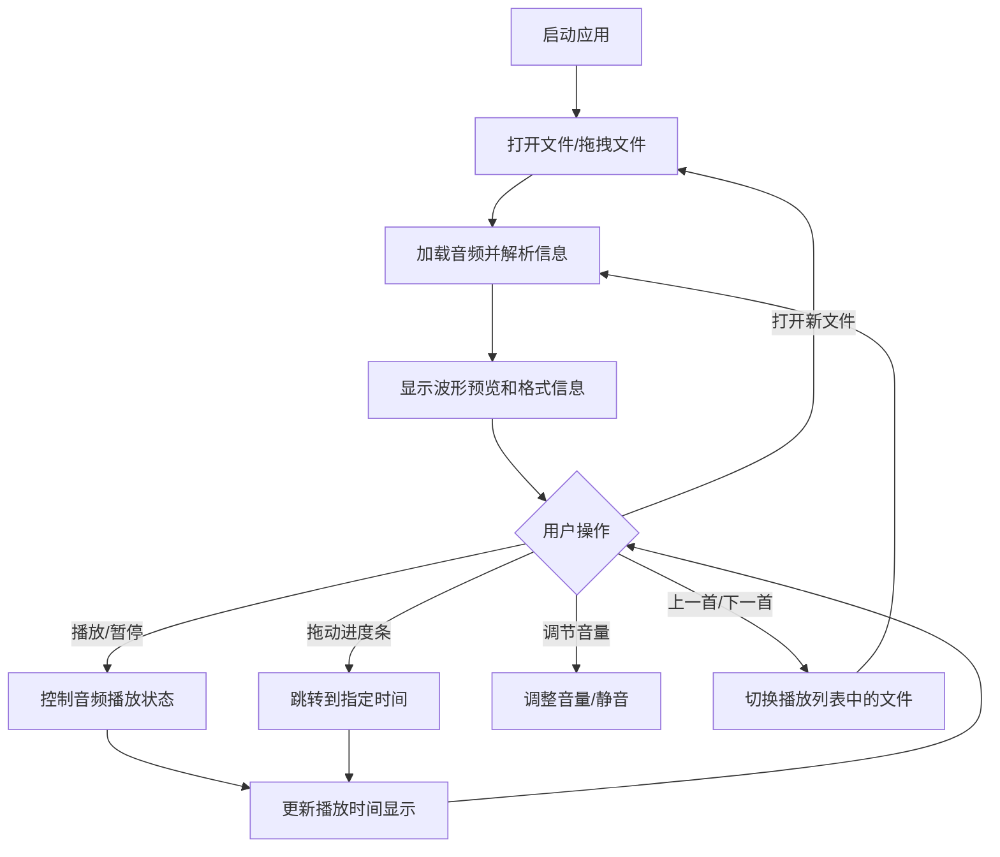

## 1. 产品概述

SoundWave 是一款现代化的桌面音频播放器应用，提供优雅的用户界面和流畅的播放体验。支持多种主流音频格式，具备完整的播放控制、音量管理和音频信息展示功能。

- 主要用途：本地音频文件播放与管理
- 目标用户：音乐爱好者、需要日常播放音频的普通用户
- 产品价值：提供简洁、美观、功能完善的音频播放体验

## 2. 核心功能

### 2.1 用户角色
| 角色 | 注册方式 | 核心权限 |
|------|---------|---------|
| 普通用户 | 无需注册 | 打开音频文件、播放控制、音量调节、查看音频信息 |

### 2.2 功能模块
1. **主播放页面**：文件打开区域、波形预览、播放控制面板、音量控制、信息显示面板、最近文件列表

### 2.3 页面详情
| 页面名称 | 模块名称 | 功能描述 |
|---------|---------|---------|
| 主播放页面 | 文件打开区 | 点击选择文件、拖拽文件上传 |
| 主播放页面 | 波形预览 | 简化版波形可视化显示 |
| 主播放页面 | 播放控制 | 播放/暂停/停止、上一首/下一首、进度条拖动 |
| 主播放页面 | 音量控制 | 音量滑块、静音按钮、音量记忆 |
| 主播放页面 | 信息显示 | 文件名、播放时间、总时长、格式信息（采样率/比特率/声道） |
| 主播放页面 | 最近文件 | 最近打开文件列表，支持快速打开 |
| 主播放页面 | 播放列表 | 多文件队列管理，支持切换播放 |

## 3. 核心流程

用户打开应用后，可以通过点击文件选择按钮或拖拽音频文件到窗口来加载音频。加载完成后自动显示波形预览和音频信息，用户可通过播放控制按钮或键盘快捷键（空格键）进行播放/暂停操作。播放过程中可拖动进度条跳转、调节音量或静音。最近打开的文件会自动保存，下次打开应用时可快速访问。

## 4. 用户界面设计

### 4.1 设计风格
- **主色调**：深色主题，以深蓝靛色为主调，搭配霓虹青绿色作为强调色
- **配色方案**：
  - 背景：#0f172a（深靛蓝）→ #1e1b4b（深紫）渐变
  - 主强调色：#22d3ee（青绿色）
  - 辅助色：#a78bfa（淡紫色）
  - 文字：#e2e8f0（浅灰白）
  - 卡片背景：rgba(30, 41, 59, 0.7)（半透明深色）
- **按钮风格**：圆角胶囊形，带有柔和发光效果，悬浮时有轻微放大动画
- **字体**：标题使用 'Space Grotesk'，正文使用 'Inter'，数字显示使用等宽字体 'JetBrains Mono'
- **布局风格**：居中卡片式布局，带有毛玻璃效果和精致阴影
- **图标风格**：使用 lucide-react 线性图标，统一线条粗细

### 4.2 页面设计概述
| 页面名称 | 模块名称 | UI 元素 |
|---------|---------|---------|
| 主播放页面 | 文件打开区 | 虚线边框拖拽区域，带发光动画，居中图标和提示文字 |
| 主播放页面 | 波形预览 | Canvas 绘制波形，渐变填充，播放进度高亮显示 |
| 主播放页面 | 播放控制 | 居中排列的圆形按钮，播放按钮最大且突出显示 |
| 主播放页面 | 进度条 | 自定义滑块，渐变进度填充，悬浮显示时间提示 |
| 主播放页面 | 音量控制 | 水平滑块 + 静音按钮，左侧音量图标 |
| 主播放页面 | 信息面板 | 网格布局，标签-值配对展示格式信息 |
| 主播放页面 | 最近文件 | 可滚动列表，悬停高亮，带删除按钮 |

### 4.3 响应式
- 桌面优先设计，主内容区域固定最大宽度
- 中等屏幕：各模块自适应排列
- 小屏幕：控制面板垂直堆叠，最近文件列表折叠
- 触摸优化：按钮最小尺寸 44px，增加点击区域

### 4.4 动效设计
- 页面加载：元素淡入 + 轻微向上位移
- 按钮交互：hover 时轻微放大 + 阴影增强 + 发光效果
- 播放状态：播放时波形有呼吸动画，按钮图标有脉冲效果
- 拖拽反馈：文件拖入时边框发光 + 背景色变化
- 时间更新：平滑过渡，避免数字跳动
