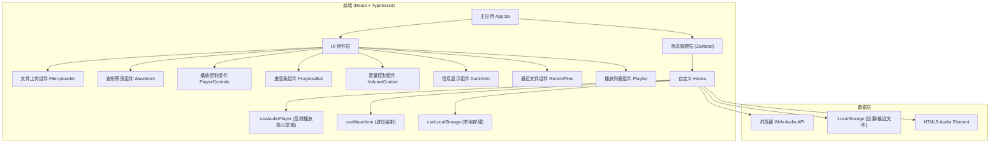

## 1. 架构设计



## 2. 技术描述

- **前端框架**：React@18 + TypeScript@5
- **构建工具**：Vite@5
- **样式方案**：TailwindCSS@3 + CSS 自定义属性
- **状态管理**：Zustand@4
- **图标库**：lucide-react@0.400
- **音频处理**：原生 Web Audio API + HTML5 Audio Element
- **本地存储**：浏览器 localStorage API
- **初始化工具**：vite-init（使用 react-ts 模板）

## 3. 目录结构

```
soundwave/
├── src/
│   ├── components/
│   │   ├── FileUploader.tsx      # 文件拖拽/选择组件
│   │   ├── Waveform.tsx          # 波形预览组件
│   │   ├── PlayerControls.tsx    # 播放控制按钮组
│   │   ├── ProgressBar.tsx       # 进度条组件
│   │   ├── VolumeControl.tsx     # 音量控制组件
│   │   ├── AudioInfo.tsx         # 音频信息面板
│   │   ├── RecentFiles.tsx       # 最近文件列表
│   │   └── Playlist.tsx          # 播放列表组件
│   ├── hooks/
│   │   ├── useAudioPlayer.ts     # 音频播放核心逻辑 Hook
│   │   ├── useWaveform.ts        # 波形数据处理 Hook
│   │   └── useLocalStorage.ts    # 本地存储 Hook
│   ├── store/
│   │   └── playerStore.ts        # Zustand 状态管理
│   ├── types/
│   │   └── audio.ts              # 类型定义
│   ├── utils/
│   │   └── format.ts             # 格式化工具函数
│   ├── pages/
│   │   └── Home.tsx              # 主页面
│   ├── App.tsx                   # 应用入口
│   ├── main.tsx                  # React 挂载入口
│   └── index.css                 # 全局样式
├── public/
├── index.html
├── package.json
├── vite.config.ts
├── tsconfig.json
├── tailwind.config.js
└── postcss.config.js
```

## 4. 路由定义

| 路由 | 用途 |
|------|------|
| / | 主播放页面（所有功能集中于此单页应用） |

## 5. 数据模型

### 5.1 类型定义

```typescript
// 音频文件信息
interface AudioFile {
  id: string;
  name: string;
  size: number;
  type: string;
  url: string;
  file?: File;
  duration?: number;
  format?: AudioFormat;
  openedAt: number;
}

// 音频格式信息
interface AudioFormat {
  sampleRate?: number;      // 采样率 (Hz)
  bitRate?: number;         // 比特率 (kbps)
  channels?: number;        // 声道数
  codec?: string;           // 编码格式
}

// 播放器状态
interface PlayerState {
  playlist: AudioFile[];
  currentIndex: number;
  currentFile: AudioFile | null;
  isPlaying: boolean;
  currentTime: number;
  duration: number;
  volume: number;
  isMuted: boolean;
  recentFiles: AudioFile[];
  waveformData: number[];
}
```

### 5.2 LocalStorage 数据存储键

| 键名 | 用途 | 类型 |
|------|------|------|
| soundwave_volume | 音量记忆 | number (0-1) |
| soundwave_muted | 静音状态 | boolean |
| soundwave_recent | 最近打开文件列表 | AudioFile[] |

## 6. 核心功能实现方案

### 6.1 文件打开
- 使用 `<input type="file" accept="audio/*">` 实现文件选择
- 通过 `dragover`/`drop` 事件实现拖拽上传
- 支持格式：MP3、WAV、FLAC、AAC、OGG（通过 accept 属性和 MIME 校验）
- 使用 `URL.createObjectURL()` 创建本地文件 URL

### 6.2 音频播放
- 使用 HTML5 `<audio>` 元素作为播放核心
- 监听 `timeupdate`、`loadedmetadata`、`ended` 等事件
- 支持播放/暂停/停止：调用 `play()`、`pause()`、设置 `currentTime=0`
- 进度条拖动：设置 `audio.currentTime` 属性

### 6.3 波形预览
- 使用 `AudioContext` + `AnalyserNode` 获取音频数据
- 使用 `OfflineAudioContext` 离线解码获取完整波形
- Canvas 2D API 绘制简化版波形图
- 播放进度通过半透明覆盖层高亮显示

### 6.4 键盘快捷键
- 监听全局 `keydown` 事件
- 空格键：切换播放/暂停
- 阻止空格键默认滚动行为

### 6.5 音频格式信息
- 使用 `AudioContext.decodeAudioData()` 获取 AudioBuffer
- 从 AudioBuffer 读取 sampleRate、numberOfChannels
- 计算比特率：(fileSize * 8) / duration / 1000
